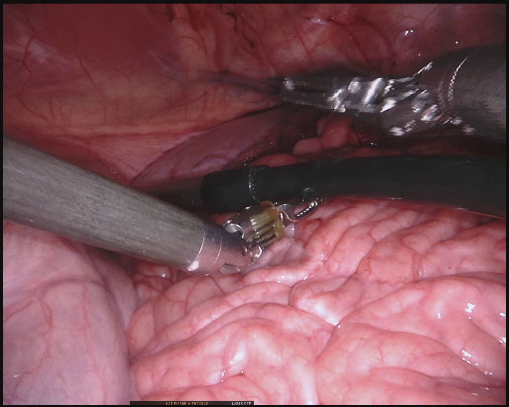

# MICCAI-2017-Robotic-Instrument-Segmentation

This repository contains the code to plot the bounding box from xml. We have annotated bounding box for the [MICCAI Surgical Instrument Segmentation Challenge 2017](https://endovissub2017-roboticinstrumentsegmentation.grand-challenge.org/) dataset for the instruments.

The diagonal coordinates of each instruments are store in the xml inlcuding instrument name. An example of the xml [xml](https://github.com/mobarakol/MICCAI-2017-Robotic-Instrument-Segmentation/blob/master/instrument_dataset_1/xml/frame000.xml) structure


<p float="center">
  
   
</p>


## xml structure
```
<annotation>
 <folder>instruments_mask</folder>
 <filename>instrument_dataset_1/instruments_masks/frame000.png
 </filename>
 <objects>
  <name>Prograsp Forceps</name>
  <bndbox>
   <xmin>698</xmin>
   <ymin>110</ymin>
   <xmax>1277</xmax>
   <ymax>366</ymax>
  </bndbox>
 </objects>
 <objects>
  <name>Bipolar Forceps</name>
  <bndbox>
   <xmin>2</xmin>
   <ymin>333</ymin>
   <xmax>818</xmax>
   <ymax>699</ymax>
  </bndbox>
 </objects>
 <objects>
  <name>Others</name>
  <bndbox>
   <xmin>337</xmin>
   <ymin>385</ymin>
   <xmax>1279</xmax>
   <ymax>559</ymax>
  </bndbox>
 </objects>
</annotation>
```

## Code
```
 _img_orig = Image.open(img_name).convert('RGB')
    img  = cv2.imread(img_name)
    _xml_dir = os.path.dirname(os.path.dirname(img_name)) + 'xml/' + os.path.basename(img_name[:-4]) + '.xml'
    _xml = ET.parse(_xml_dir).getroot()
    class_to_ind = dict(zip(INSTRUMENT_CLASSES, range(len(INSTRUMENT_CLASSES))))
    
    for obj in _xml.iter('objects'):
        name = obj.find('name').text.strip()
        bbox = obj.find('bndbox')
        bbox_col = INSTRUMENT_CLASSES.index(str(name)) - 1;
        pts = ['xmin', 'ymin', 'xmax', 'ymax']
        bndbox = []
        label_idx = class_to_ind[name]
        for i, pt in enumerate(pts):         
            cur_pt = int(bbox.find(pt).text)
            bndbox.append(cur_pt)
            
        top_corner, down_corner = (int(bndbox[0]), int(bndbox[1])), (int(bndbox[2]), int(bndbox[3]))
        cv2.rectangle(img, top_corner, down_corner, color_mode[bbox_col], thickness=4)
        cv2.putText(img,str(name),(top_corner[0]+5, top_corner[1]+25), font, 1,color_mode[bbox_col],1,cv2.LINE_AA)       
        plt.imshow(img[:,:,::-1])
        plt.imsave(os.path.basename(img_name), img[:,:,::-1])
```
